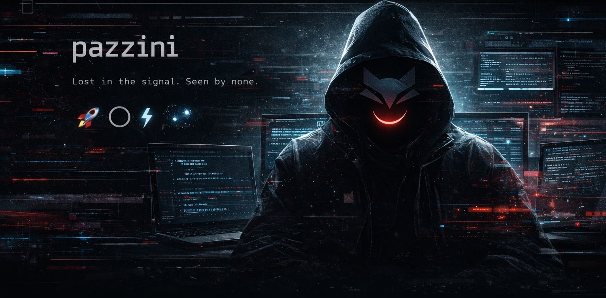

<!-- ===================== -->
<!-- BANNER -->
<!-- ===================== -->

  

  

  <i>Not hidden. Just not indexed.</i>

  

## 🕶️ Who am I?

Hey! You can call me **Pazzini**.

🧠 Computer Science & Cybersecurity student, exploring systems, attack surfaces, and the unseen behavior of the web.

👁️ I prefer observing before acting.  
🧩 Code, flaws, and patterns speak louder than speeches.

🔭 Building projects at the intersection of technology and security.

  

## ⚙️ Field Kit

### 💻 Dev & Security Stack

  

### 🔐 Cyber / Security
- AppSec
- Recon & OSINT
- Security automation
- Attack surface mapping
- Labs & CTFs

  

## 🧠 Method

> “If you noticed me, it was intentional.”

- Observe first 
- Execute silently
- Document only what matters  

  

## 📡 Signal

> Low noise. High intent.

  

  

